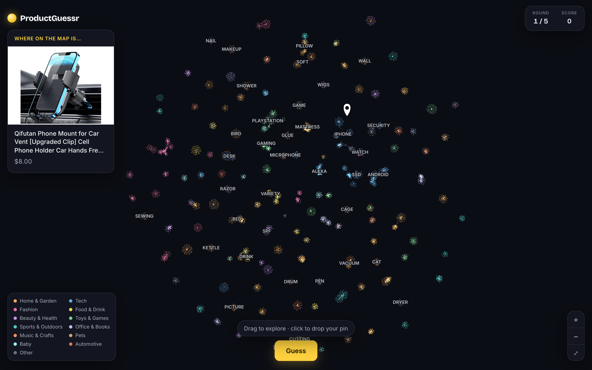
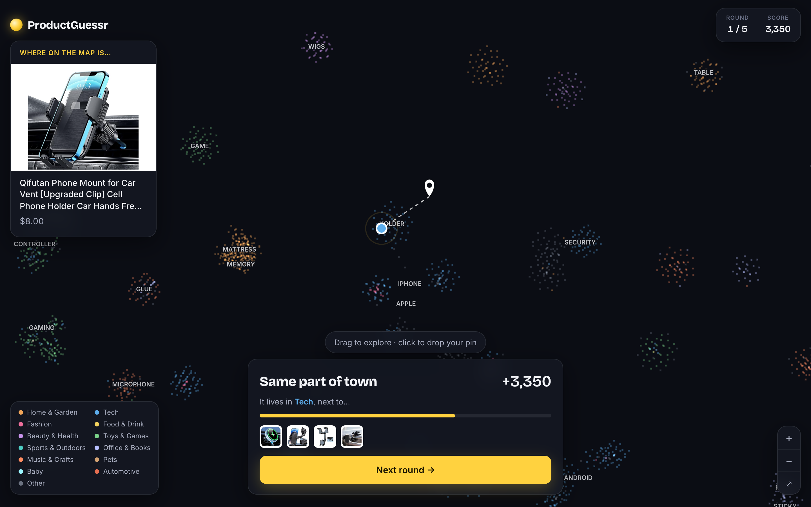
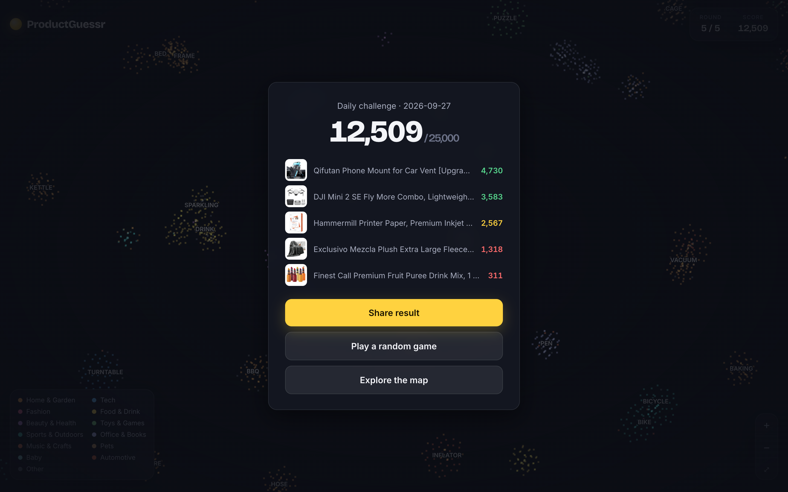

# ProductGuessr

GeoGuessr, but for products. [BehaviorGPT](https://github.com/Unbox-AI/behaviorgpt) has placed 8,409 products on a map where similar things live side by side. You get a product, drop a pin where you think it lives, and score up to 5,000 points depending on how close you land. Five rounds, a daily challenge, and a shareable result.



It is a small, complete example of building on the BehaviorGPT SDK's embedding map: harvesting products, embedding them as your own catalog, pulling coordinates out of `client.umap()`, and turning them into a game that runs without an API key.

> Status: working prototype.

## What it shows

| In the game | BehaviorGPT call |
|---|---|
| The products | `client.complete(history=[Search(q)])` over 150 everyday queries, plus the cold-start ranking |
| Your own catalog to map | `client.embed(parquet)` |
| The map itself | `client.umap(catalog_id=...)`, coordinates parsed out of the Plotly page |
| "It lives next to…" after each guess | the product's nearest neighbours on that map |



## Play it locally

The built map is committed in `docs/data.json`, so playing needs no key at all:

```sh
git clone https://github.com/Jenspalmborg/productguessr.git
cd productguessr
python3 -m http.server 8000 -d docs
```

Open http://localhost:8000. Links like `/?seed=2026-09-27` replay the same five products, so friends can play the same game.

The site is plain HTML, CSS and JS with no build step, so GitHub Pages can host it straight from the `docs/` folder.

## Rebuild the map

Needs Python 3.11+, [uv](https://github.com/astral-sh/uv) and a BehaviorGPT API key from [unboxai.com/behaviorgpt](https://unboxai.com/behaviorgpt).

```sh
uv sync
cp .env.example .env                        # paste your key as UNBOXAI_API_KEY

uv run python scripts/harvest.py            # ~8,400 products from retail_catalog (~1 min)
uv run python scripts/embed.py --sample 300 # optional: quick test upload first
uv run python scripts/embed.py              # upload and embed them (a few minutes)
uv run python scripts/build_map.py          # fetch the map, write docs/data.json
```

## How it was built

1. **Harvest.** The pre-embedded catalogs have no map (`umap` returns a server error for them), so [`harvest.py`](scripts/harvest.py) copies products into a catalog of our own. It runs 150 searches across everyday shopping areas plus the popularity ranking, and drops near-identical variants ("Nike Men's Retro" × 20), which would otherwise pile onto one spot and make rounds repetitive.
2. **Embed.** The API returns every field as a string (`"None"`, `"[1, 2, 3]"`), so [`embed.py`](scripts/embed.py) converts each column back to the types in the [catalog format](https://github.com/Unbox-AI/behaviorgpt/blob/main/docs/catalog-format.md) before uploading. Each API key holds one catalog: a new upload replaces the previous one under the same id.
3. **Map.** [`build_map.py`](scripts/build_map.py) pulls the coordinates out of the `umap` page, as [aic-artworks](https://github.com/Unbox-AI/aic-artworks) does. The model packs similar products onto the exact same point (8,409 products on ~1,900 spots), so each stack is fanned out in a tiny sunflower spiral to give every product its own dot.
4. **Landmarks.** For each region of the map, the word that is far more common there than elsewhere ("espresso", "mattress", "iphone") becomes a label, so players can find their way.
5. **Game.** [`docs/index.html`](docs/index.html) draws the map on a canvas with pan, zoom and pinch. Scoring is `5000 × e^(−distance / 0.09)` in map units. Rounds are drawn with a seeded RNG, from popular products with descriptive titles, spread over different departments. Hovering over products only works after you guess, so no peeking.

## What the map looks like up close

Locally the map is very good: 82% of each product's ten nearest neighbours are from the same department (13% by chance), and the neighbours are the kind of thing you'd expect (phone mounts next to phone mounts, pasta next to ravioli). Globally it is an archipelago rather than continents: each department is spread over many small islands. That is what makes it a game. Knowing a phone mount is "Tech" isn't enough; you have to find the phone-accessory island.



## Layout

```
scripts/
  harvest.py      retail_catalog -> data/products.jsonl
  embed.py        products -> data/productguessr.parquet -> embedded catalog
  build_map.py    umap page -> docs/data.json (points, landmarks, round pool)
docs/
  index.html      the game (no build step)
  data.json       the built map
  screenshots/    README images
data/             harvested products, parquet, catalog id (git-ignored)
```

## Data and license

Product names, prices and images come from BehaviorGPT's pre-embedded `retail_catalog`; images are hot-linked, not copied. The code is MIT licensed.
